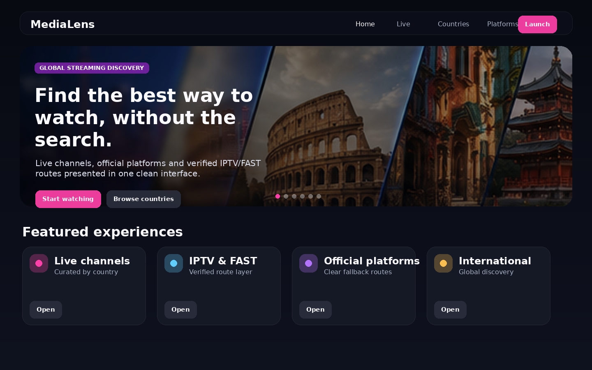
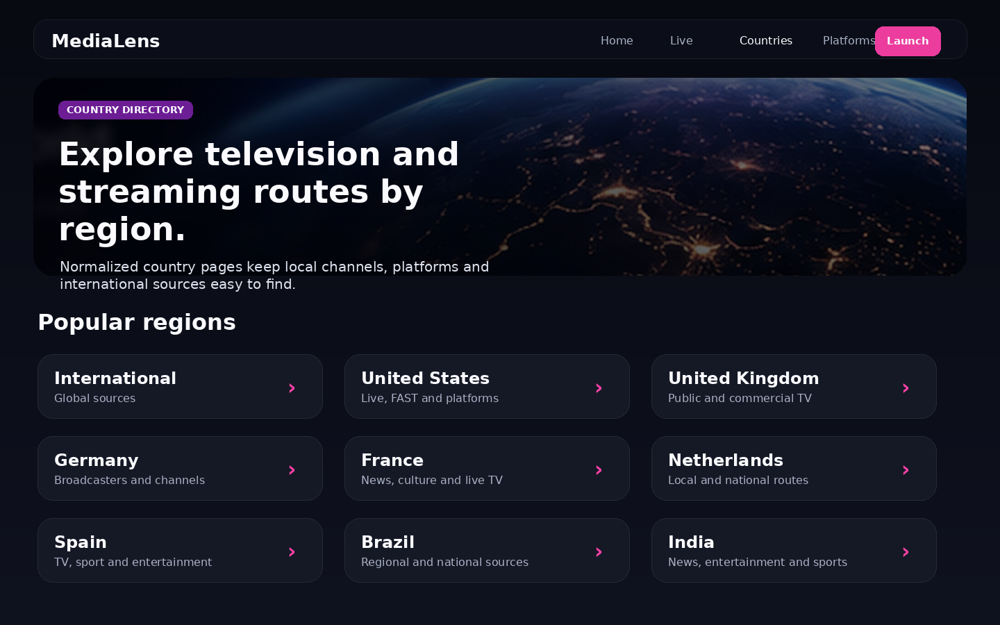
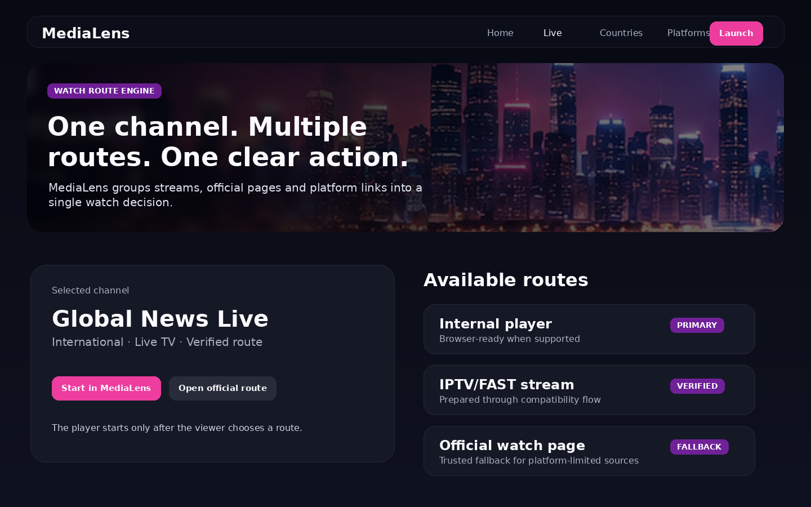

# MediaLens Core

**MediaLens Core** is a consumer-facing streaming discovery interface for live television, official streaming platforms and verified IPTV/FAST routes. It is designed to turn a fragmented media landscape into a clear watch experience: viewers choose a country, channel or category, and MediaLens presents the best available route to watch.



## What MediaLens does

MediaLens combines channel data, official platform links, live stream routes and IPTV/FAST imports into a single discovery layer. Instead of exposing a raw source list, the interface groups related routes around a watchable destination and shows a clear primary action.

Core capabilities:

- **Global media discovery** across countries, regions and international sources.
- **Watch-route grouping** for channels that have multiple possible viewing paths.
- **Internal player flow** for browser-compatible streams, with an explicit viewer-controlled start action.
- **Official route fallback** when a stream is not suitable for direct browser playback.
- **IPTV/FAST import pipeline** for large verified feed sets.
- **Multilingual interface foundation** with a compact cinematic leader and international visual direction.

## Current catalog status

The verified shipping catalog on `main` currently contains:

- **2,900 total sources**;
- **2,242 direct-player sources**;
- **49 imported IPTV inputs**;
- **287 watch-graph channels** and **289 watch-graph routes** across **23 countries**;
- catalog contract version **1.0.0**.

The 2,900 sources consist of 764 existing/base MediaLens sources plus 373 accepted TDTChannels additions, 702 M3UPT additions, 63 FreeCastHub additions and 998 Free-TV/IPTV recovery additions. Famelack remains candidate-evidence gated, IPTV Nexus is enrichment-only, and IPTVCat/LyngSat remain discovery-only, so those integrations do not add unverified sources directly to the shipping catalog.

See [Current source status](docs/SOURCE_STATUS.md) for the auditable source-count breakdown and [Source-expansion completion](docs/SOURCE_EXPANSION_COMPLETION.md) for acceptance evidence.

## Current full-feed test

A fresh isolated live test of all **13 legacy/full-feed sources** was run on **2026-08-20** against the 2,900-source shipping baseline. It processed **21,341 candidates**, blocked **6,369 import duplicates**, rebuilt **13,922 globally visible imported sources**, and the sync dry-run projected **14,059 net new sources**. A legacy full sync would therefore project **16,959 total catalog sources**.

The **16,959** value is a tested dry-run projection, not the current shipping catalog. No catalog source was published by this test. The run also exposed a 137-record order-dependent duplicate/reporting difference in the legacy importer, which is documented explicitly rather than treated as a shipping result.

See [Full-feed import test](docs/FULL_FEED_IMPORT_TEST.md) for the complete per-feed results and machine-readable evidence.

## How the system is structured

MediaLens is built around four layers:

1. **Source catalog** — normalized source records for channels, platforms, live streams and external watch routes.
2. **Watch graph** — a grouped view that connects a channel or destination to all available routes.
3. **Route engine** — chooses the most appropriate primary action for the viewer: internal player, verified IPTV/FAST route, official watch page or trusted fallback.
4. **Consumer interface** — presents the result as a simple streaming product rather than a technical catalog.

This structure makes it possible to add thousands of IPTV/FAST entries while keeping the end-user experience clean and predictable.

## IPTV/FAST expansion

MediaLens uses a gated source-expansion pipeline rather than treating raw feed size as a shipping metric. New external candidates remain non-consumer-visible until they pass dedupe, safety/DRM, provenance/rights, live-probe, approval and explicit promotion gates.

The completed controlled expansion added **2,136 accepted sources** to the original catalog and brought the verified shipping state to **2,900 total sources**, including **2,242 direct-player sources**.

See [IPTV/FAST import](docs/IPTV_FAST_IMPORT.md) for the workflow.

## Screenshots

| Home | Country directory | Watch routes |
| --- | --- | --- |
|  |  |  |

Additional visual references are available in [`screenshots/interface-references.png`](screenshots/interface-references.png).

## Quick start

```bash
npm install
npm run verify
npm run serve
```

Open `http://localhost:5173`.

For local stream compatibility support:

```bash
npm run serve:player
```

## Useful commands

```bash
npm run verify                 # Validate the release package
npm run build:watch-graph      # Rebuild grouped watch routes
npm run import:iptv-feeds      # Import and sync IPTV/FAST sources
npm run serve                  # Start the static app
npm run serve:player           # Start the local player compatibility server
```

## Documentation

- [Getting started](docs/GETTING_STARTED.md)
- [Project structure](docs/PROJECT_STRUCTURE.md)
- [Current source status](docs/SOURCE_STATUS.md)
- [Full-feed import test](docs/FULL_FEED_IMPORT_TEST.md)
- [Source policy](docs/SOURCE_POLICY.md)
- [IPTV/FAST import](docs/IPTV_FAST_IMPORT.md)
- [Source-expansion completion](docs/SOURCE_EXPANSION_COMPLETION.md)
- [Release 1.0.0](docs/RELEASE_1_0.md)
- [Screenshots](docs/SCREENSHOTS.md)
- [Disclaimer](DISCLAIMER.md)
- [Third-party content and source data](THIRD_PARTY_CONTENT.md)

## License

MediaLens Core is licensed under the [Apache License 2.0](LICENSE).

The license applies to the MediaLens Core software, documentation, build scripts and project-owned interface assets. It does not grant rights to third-party media content, channel brands, logos, IPTV/FAST streams, broadcaster services, external platform content or third-party metadata. See [`DISCLAIMER.md`](DISCLAIMER.md), [`THIRD_PARTY_CONTENT.md`](THIRD_PARTY_CONTENT.md) and [`NOTICE`](NOTICE) for additional terms and context.
